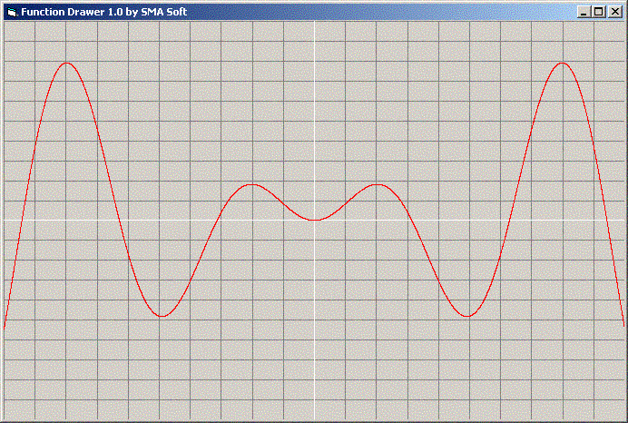



## Drawing the Chart of a math function

### Description

This code draws the chart of a math function
 
### More Info
 
a math function

working with functions

its chart

             |
---                |---
**Submitted On**   |2003-11-15 23:35:56
**By**             |[SMA Soft](https://github.com/Planet-Source-Code/PSCIndex/blob/master/ByAuthor/sma-soft.md)
**Level**          |Beginner
**User Rating**    |4.3 (17 globes from 4 users)
**Compatibility**  |VB 4\.0 \(16\-bit\), VB 4\.0 \(32\-bit\), VB 5\.0, VB 6\.0
**Category**       |[Math/ Dates](https://github.com/Planet-Source-Code/PSCIndex/blob/master/ByCategory/math-dates__1-37.md)
**World**          |[Visual Basic](https://github.com/Planet-Source-Code/PSCIndex/blob/master/ByWorld/visual-basic.md)
**Archive File**   |[Drawing\_th16728311162003\.zip](https://github.com/Planet-Source-Code/sma-soft-drawing-the-chart-of-a-math-function__1-49945/archive/master.zip)

